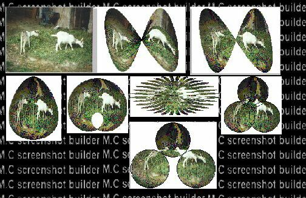



## Shaper \- unlimited number of deformations

### Description

Missing module added ! + minor changes. I trhink you must see this. Leave comment, vote for idea id you like
 
### More Info
 

             |
---                |---
**Submitted On**   |2002-08-25 18:06:16
**By**             |[M\.C](https://github.com/Planet-Source-Code/PSCIndex/blob/master/ByAuthor/m-c.md)
**Level**          |Advanced
**User Rating**    |5.0 (10 globes from 2 users)
**Compatibility**  |VB 6\.0
**Category**       |[Graphics](https://github.com/Planet-Source-Code/PSCIndex/blob/master/ByCategory/graphics__1-46.md)
**World**          |[Visual Basic](https://github.com/Planet-Source-Code/PSCIndex/blob/master/ByWorld/visual-basic.md)
**Archive File**   |[Shaper\_\-\_u1109057262002\.zip](https://github.com/Planet-Source-Code/m-c-shaper-unlimited-number-of-deformations__1-37267/archive/master.zip)

